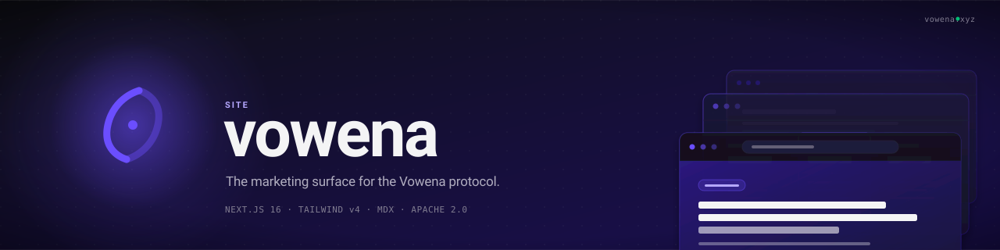

<div align="center">
  <a href="https://vowena.xyz">
    
  </a>

  <p>
    <strong>The marketing surface for the Vowena protocol.</strong><br/>
    Landing, pricing, and a blog about building trustless recurring payments on Stellar.
  </p>

  <p>
    <a href="LICENSE"></a>
    <a href="https://github.com/vowena/site/actions/workflows/ci.yml"></a>
    <a href="https://nextjs.org"></a>
    <a href="https://vowena.xyz"></a>
  </p>

  <p>
    <a href="https://vowena.xyz">vowena.xyz</a>
    &nbsp;&middot;&nbsp;
    <a href="https://vowena.xyz/blog">Blog</a>
    &nbsp;&middot;&nbsp;
    <a href="https://vowena.xyz/pricing">Pricing</a>
    &nbsp;&middot;&nbsp;
    <a href="https://github.com/vowena/protocol">Protocol</a>
  </p>
</div>

<br/>

## What is this?

The public marketing site for [Vowena](https://github.com/vowena/protocol), the recurring payments protocol on Stellar. It explains what the protocol does, publishes pricing for the hosted dashboard, and hosts a technical blog about subscription billing, the Stellar ecosystem, and what we are building. Live at **[vowena.xyz](https://vowena.xyz)**.

> The protocol lives in [vowena/protocol](https://github.com/vowena/protocol). The dashboard lives in [vowena/dashboard](https://github.com/vowena/dashboard). This repo is the storefront.

<br/>

## Stack

| Layer          | Choice                                                                                       |
| -------------- | -------------------------------------------------------------------------------------------- |
| **Framework**  | [Next.js 16](https://nextjs.org) (App Router, React 19, TypeScript)                          |
| **Styling**    | [Tailwind CSS v4](https://tailwindcss.com) with custom design tokens, DM Sans + Space Mono   |
| **Content**    | MDX via [`next-mdx-remote`](https://github.com/hashicorp/next-mdx-remote) v6, gray-matter    |
| **Highlighting** | [highlight.js](https://highlightjs.org) with custom violet syntax theme                   |
| **Theme**      | [`next-themes`](https://github.com/pacocoursey/next-themes), light-first with dark toggle    |
| **Deployment** | [Vercel](https://vercel.com)                                                                 |
| **SEO**        | Dynamic OG and Twitter card images per route, `sitemap.xml`, `robots.txt`                    |
| **Analytics**  | [Umami](https://umami.is) (privacy-friendly, cookie-free)                                    |

<br/>

## Features

- **Landing page** with hero, how-it-works, dashboard preview, dev SDK integration, and pricing tease
- **Pricing page** with Free, Pro, and Enterprise tiers and a structured FAQ
- **MDX blog** with frontmatter-driven routing, syntax highlighting, copy-to-clipboard buttons, and cover images
- **Custom MDX components** for callouts, install tabs, and embedded video
- **Dynamic OG and Twitter card images** generated per route from JSX
- **Dark mode** with system preference detection and manual toggle
- **`sitemap.xml` and `robots.txt`** generated from the route tree
- **Brand-consistent typography** using DM Sans and Space Mono
- **Legal pages** for privacy and terms

<br/>

## Local development

Requires Node.js 22 or later.

```bash
git clone https://github.com/vowena/site.git
cd site
npm install
cp .env.example .env.local
npm run dev
```

The site runs at [http://localhost:3000](http://localhost:3000).

### Scripts

| Command             | Purpose                          |
| ------------------- | -------------------------------- |
| `npm run dev`       | Start the dev server with HMR    |
| `npm run build`     | Production build                 |
| `npm run start`     | Run the production build locally |
| `npm run lint`      | ESLint (Next.js config)          |
| `npm run typecheck` | TypeScript no-emit check         |

<br/>

## Writing a blog post

Posts live in [`content/blog/`](./content/blog) as `.mdx` files. The slug of the URL is the filename: `content/blog/my-post.mdx` ships at `/blog/my-post`.

### 1. Create the file

```bash
touch content/blog/your-post-slug.mdx
```

### 2. Add frontmatter

Every post needs the following fields. They are parsed by [gray-matter](https://github.com/jonschlinkert/gray-matter) and used for routing, listing, and OG images.

```mdx
---
title: "Your post title"
description: "A short summary used for SEO and social cards."
date: "2026-04-21"
author: "Your Name"
cover: "https://images.unsplash.com/photo-example?w=1200&h=630&fit=crop"
---
```

| Field         | Type     | Notes                                                                  |
| ------------- | -------- | ---------------------------------------------------------------------- |
| `title`       | string   | Used for `<h1>`, page title, and OG cards                              |
| `description` | string   | Used for meta description and social cards                             |
| `date`        | ISO date | Drives chronological ordering on `/blog`                               |
| `author`      | string   | Shown on the post and the index. Falls back to `"Vowena"`              |
| `cover`       | URL      | Optional. Shown on the index card and the post hero                    |

### 3. Write the body

Standard markdown plus GFM tables, task lists, and fenced code blocks. Code blocks render through highlight.js using the brand violet syntax theme.

````mdx
```rust
fn approve(from: Address, spender: Address, amount: i128) {
    // Highlighted in violet, with a copy button.
}
```
````

### 4. Use custom MDX components

These are available in any post without importing them:

| Component                                              | Purpose                                |
| ------------------------------------------------------ | -------------------------------------- |
| `<Callout type="info \| warning \| tip">…</Callout>`   | Highlighted aside, color-coded by type |
| `<Video src="https://..." title="Demo" />`             | Responsive 16:9 iframe embed           |
| `<InstallTabs />`                                      | Tabbed install instructions per package manager |

That is the entire authoring surface. Save the file and the post is live on the next build.

<br/>

## SEO

- **Per-route OG and Twitter images.** Every page (and every blog post) ships an `opengraph-image.tsx` and `twitter-image.tsx` rendered with the Next.js Image Response API. Brand colors and typography are baked in.
- **Sitemap.** [`src/app/sitemap.ts`](./src/app/sitemap.ts) walks the route tree and the MDX blog index to produce `/sitemap.xml`.
- **Robots.** [`src/app/robots.ts`](./src/app/robots.ts) emits `/robots.txt` and points at the sitemap.
- **Canonical URLs and structured metadata.** Every page exports `generateMetadata` with a canonical URL, OG, and Twitter tags.

<br/>

## Project layout

```
src/
  app/
    blog/                  MDX-powered blog index and dynamic routes
    pricing/               Plan comparison and FAQ
    privacy/  terms/       Legal pages
    opengraph-image.tsx    Root OG image
    sitemap.ts robots.ts   SEO surface
  components/              UI primitives, MDX components, theme provider
  lib/                     blog loader, syntax highlighting, config
content/
  blog/                    MDX source files (one per post)
public/                    Logos, favicons, static assets
.github/                   Banner, workflows, issue templates
```

<br/>

## Related projects

| Repo                                                       | Description                                                |
| ---------------------------------------------------------- | ---------------------------------------------------------- |
| [vowena/protocol](https://github.com/vowena/protocol)      | Soroban smart contracts. The recurring payments protocol.  |
| [vowena/sdk](https://github.com/vowena/sdk)                | TypeScript SDK for integrating Vowena into your app.       |
| [vowena/dashboard](https://github.com/vowena/dashboard)    | Merchant and subscriber dashboard at `dashboard.vowena.xyz`. |
| [vowena/docs](https://github.com/vowena/docs)              | Developer documentation at `vowena.xyz/docs`.              |

<br/>

## Contributing

Issues and pull requests are welcome. Please read [CONTRIBUTING.md](./CONTRIBUTING.md), [CODE_OF_CONDUCT.md](./CODE_OF_CONDUCT.md), and [SECURITY.md](./SECURITY.md) before opening one.

<br/>

## License

Licensed under the [Apache License 2.0](./LICENSE).

<br/>

<div align="center">
  <sub>Built by the Vowena team. Quiet confidence, protocol-grade permanence.</sub>
</div>
